# Enemigos de Zelda: Breath of the Wild

Fuente base: [Zelda Central - Enemigos y monstruos](https://es.zeldacentral.com/games/breath-of-the-wild/enemies-and-monsters/)

Carpeta de imagenes: `imagenes/`

Nota editorial: este archivo reescribe y organiza la informacion de la fuente para usarla como base de un libro familiar. Las imagenes fueron guardadas localmente con nombres simples para poder ubicarlas y maquetarlas despues. La fuente incluye `Aerocuda`; conviene revisar esa entrada si el libro sera estrictamente solo de Breath of the Wild.

## Indice

- [Monstruos comunes](#monstruos-comunes)
- [Guardianes](#guardianes)
- [Mini-jefes y jefes del mundo](#mini-jefes-y-jefes-del-mundo)
- [Clan Yiga](#clan-yiga)
- [Enemigos elementales y magicos](#enemigos-elementales-y-magicos)
- [Jefes de mazmorra](#jefes-de-mazmorra)
- [Jefe final](#jefe-final)

## Monstruos comunes

### Bokoblin

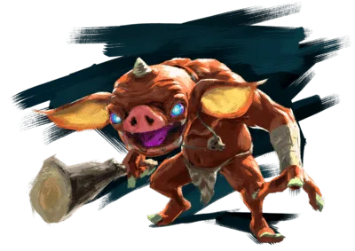

Imagen local: `imagenes/01-bokoblin.png`

Tipo: Monstruo comun.

Descripcion: El Bokoblin es uno de los enemigos mas reconocibles de Hyrule. Tiene aspecto de cerdito monstruoso, suele vivir en campamentos y puede usar garrotes, lanzas, arcos o cualquier arma sencilla que encuentre.

Variantes: Rojo, azul, negro, plateado y Stalbokoblin.

Como enfrentarlo: Suele caer rapido si Link ataca con cuidado. Los disparos a la cabeza lo aturden, las bombas sirven contra grupos y la electricidad puede hacer que suelte el arma.

Idea para el libro: Perfecto para presentar a los enemigos traviesos que hacen ruido en los campamentos.

### Moblin

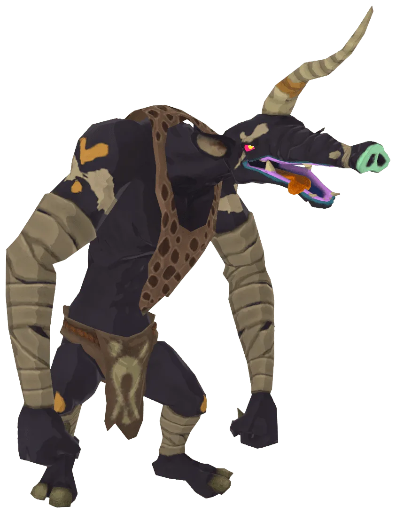

Imagen local: `imagenes/02-moblin.png`

Tipo: Monstruo comun grande.

Descripcion: El Moblin es mas alto, fuerte y resistente que un Bokoblin. Sus brazos largos le permiten atacar desde lejos y normalmente carga armas pesadas.

Variantes: Rojo, azul, negro, plateado y Stalmoblin.

Como enfrentarlo: Conviene no confiarse por su lentitud, porque sus golpes hacen mucho dano. Es buena idea esquivar, apuntar a la cabeza o usar Estasis+ para abrir una oportunidad.

Idea para el libro: Puede aparecer como el grandulon del grupo, torpe pero peligroso.

### Lizalfos

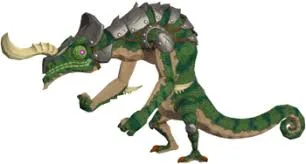

Imagen local: `imagenes/03-lizalfos.jpg`

Tipo: Monstruo agil.

Descripcion: Los Lizalfos parecen lagartos veloces. Se mueven de forma impredecible, pueden camuflarse y atacan tanto de cerca como a distancia.

Variantes: Verde, azul, negro, plateado, Stalizalfos, aliento de fuego, aliento de hielo y electrico.

Como enfrentarlo: Hay que seguirlos con el fijado de objetivo y aprovechar sus debilidades elementales: hielo contra fuego, fuego contra hielo y distancia contra los electricos.

Idea para el libro: Funcionan muy bien como enemigos escurridizos, rapidos y dificiles de atrapar.

### Octorok

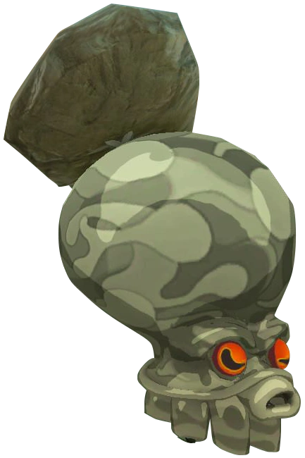

Imagen local: `imagenes/04-octorok.webp`

Tipo: Monstruo emboscador.

Descripcion: Los Octorok son criaturas parecidas a pulpos que se esconden y disparan rocas cuando Link se acerca.

Variantes: De agua, bosque, roca, nieve y cielo.

Como enfrentarlo: La tecnica clasica es devolverles sus proyectiles con el escudo. En tierra tambien se pueden derrotar con bombas cerca de su escondite.

Idea para el libro: Son ideales para una pagina de sorpresa, como si una roca cobrara vida.

### Aerocuda

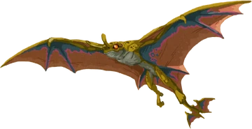

Imagen local: `imagenes/05-aerocuda.webp`

Tipo: Criatura voladora.

Descripcion: En la fuente aparece como una criatura alada que sobrevuela zonas frias o montanosas y puede cargar objetos o enemigos.

Variantes: La fuente no lista variantes para esta entrada.

Como enfrentarlo: La mejor respuesta son las flechas. Un buen disparo lo hace caer y tambien puede soltar lo que lleve entre sus garras.

Idea para el libro: Usarlo como amenaza del cielo, pero revisar si se mantiene en una version estricta de Breath of the Wild.

### Guijarro

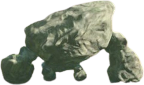

Imagen local: `imagenes/06-guijarro.webp`

Tipo: Mini Talus.

Descripcion: El Guijarro parece una roca pequena hasta que se mueve. Es una version diminuta de los Talus de piedra.

Variantes: La fuente lo presenta como criatura rocosa pequena.

Como enfrentarlo: Tiene poca resistencia. Link puede golpearlo, usar bombas o levantarlo y lanzarlo.

Idea para el libro: Puede servir para mostrar que en Hyrule hasta una piedra pequena puede esconder un susto.

## Guardianes

### Guardian acosador

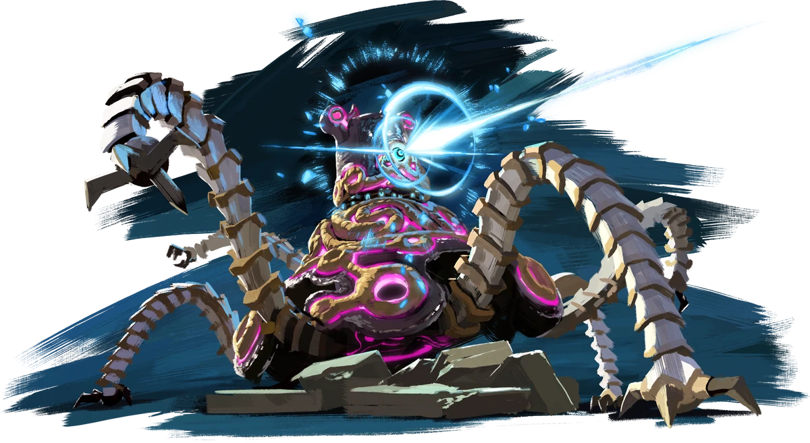

Imagen local: `imagenes/07-guardian-acosador.webp`

Tipo: Maquina antigua corrompida.

Descripcion: Es el Guardian de muchas patas que patrulla campos abiertos. Su laser es uno de los ataques mas temidos del juego.

Variantes: Forma movil de los Guardianes.

Como enfrentarlo: La parada perfecta con escudo puede devolver el laser. Tambien sirven las flechas antiguas al ojo y cortar sus patas para frenarlo.

Idea para el libro: Puede ser el primer gran enemigo mecanico, con una presencia inquietante y brillante.

### Guardian Observador del Cielo

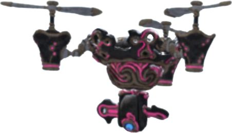

Imagen local: `imagenes/08-guardian-observador-del-cielo.webp`

Tipo: Guardian volador.

Descripcion: Patrulla desde el aire con helices y un foco que busca a Link desde arriba.

Variantes: Guardian aereo.

Como enfrentarlo: Una flecha antigua al ojo es la forma mas directa. Tambien se pueden romper sus helices para hacerlo caer.

Idea para el libro: Perfecto para una escena donde Link se esconde de una luz que barre el suelo.

### Torreta Guardiana

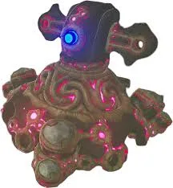

Imagen local: `imagenes/09-torreta-guardiana.jpg`

Tipo: Guardian estacionario.

Descripcion: Es un canon fijo que suele proteger zonas peligrosas, especialmente estructuras del castillo.

Variantes: Guardian inmovil.

Como enfrentarlo: Hay que cubrirse bien y reflejar sus rayos o atacarla al ojo con flechas antiguas.

Idea para el libro: Sirve para representar las defensas antiguas que quedaron atrapadas por la malicia.

### Guardian Explorador (I-IV)

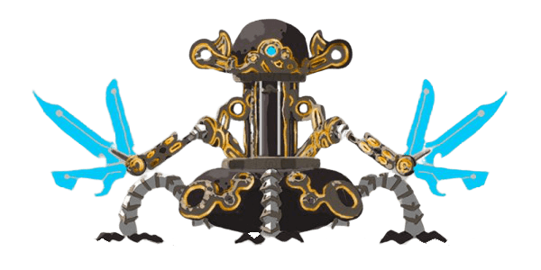

Imagen local: `imagenes/10-guardian-explorador.png`

Tipo: Guardian de santuario.

Descripcion: Son Guardianes mas pequenos que aparecen en santuarios y pruebas de fuerza. Cambian su dificultad del nivel I al IV.

Variantes: I, II, III y IV.

Como enfrentarlo: Usan armas cuerpo a cuerpo y lasers. Conviene esquivar, usar pilares como cobertura y atacar con armas antiguas cuando haya abertura.

Idea para el libro: Funcionan como pequenos duelistas mecanicos que prueban la valentia de Link.

### Guardian decaido

Imagen local: `imagenes/11-guardian-decaido.jpg`

Tipo: Guardian roto.

Descripcion: Son restos inmoviles de Guardianes. Parecen chatarra antigua, pero algunos aun pueden despertar y disparar.

Variantes: Guardian inmovil deteriorado.

Como enfrentarlo: Su laser suele ser mas facil de reflejar que el de un Guardian completo. Un buen parry puede terminar el combate de inmediato.

Idea para el libro: Ideal para una pagina de tension: algo viejo y quieto que de pronto enciende su ojo.

## Mini-jefes y jefes del mundo

### Talus de piedra

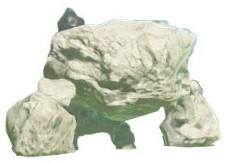

Imagen local: `imagenes/12-talus-de-piedra.webp`

Tipo: Jefe del mundo.

Descripcion: Es un gigante de roca que parece parte del paisaje hasta que se levanta y ataca.

Variantes: Piedra, luminoso, igneo y escarchado.

Como enfrentarlo: Su punto debil es el deposito de mineral en su cuerpo. Link debe subir cuando tenga oportunidad y golpear esa zona con fuerza.

Idea para el libro: Una montana que despierta es una imagen potente para una doble pagina.

### Hinox

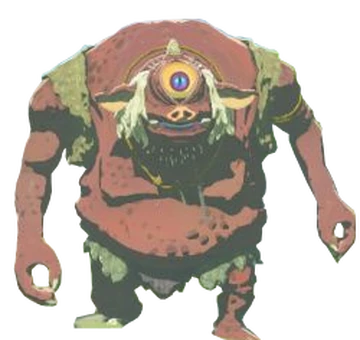

Imagen local: `imagenes/13-hinox.webp`

Tipo: Jefe del mundo.

Descripcion: El Hinox es un gigante de un solo ojo que suele dormir en campos o bosques. A menudo guarda armas u objetos importantes.

Variantes: Rojo, azul, negro y Stalnox.

Como enfrentarlo: El ojo es su punto debil. Un flechazo puede aturdirlo y dar tiempo para atacar.

Idea para el libro: Puede aparecer como un gigante dormilon que protege un tesoro sin darse cuenta.

### Molduga

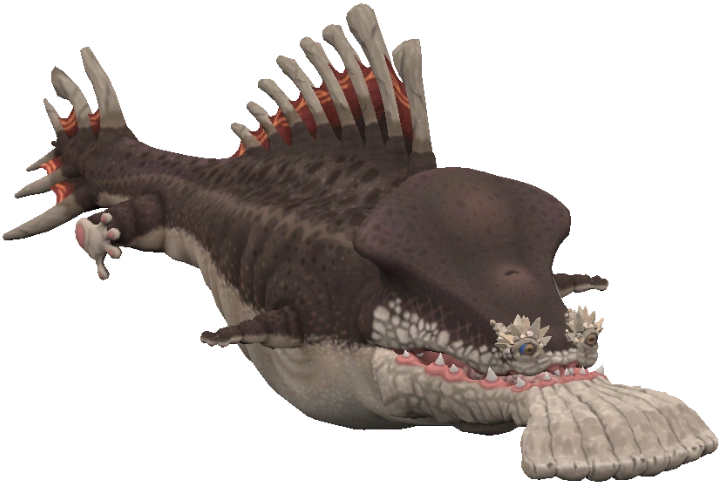

Imagen local: `imagenes/14-molduga.webp`

Tipo: Jefe del desierto.

Descripcion: La Molduga es un monstruo enorme que nada bajo la arena del Desierto Gerudo y detecta vibraciones.

Variantes: La fuente no lista variantes para esta entrada.

Como enfrentarlo: Se puede atraer con bombas remotas. Cuando salta para tragarlas, Link puede detonarlas y atacarla mientras queda aturdida.

Idea para el libro: Es perfecta para una escena de arena que se mueve como si escondiera algo gigante.

### Lynel

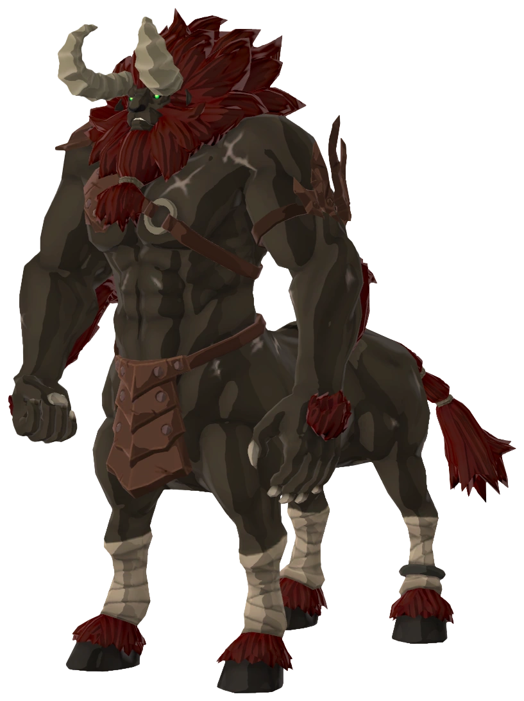

Imagen local: `imagenes/15-lynel.webp`

Tipo: Enemigo elite.

Descripcion: El Lynel parece un centauro feroz. Es uno de los enemigos mas dificiles fuera de los jefes principales.

Variantes: Melena roja, azul, blanca, plateada y dorada en Modo Maestro.

Como enfrentarlo: Exige dominar esquivas, paradas y disparos a la cabeza. Cuando se aturde, Link puede montarlo y atacar sin gastar durabilidad del arma.

Idea para el libro: Puede presentarse como el rival que impone respeto, no como un simple monstruo.

## Clan Yiga

### Soldado de infanteria Yiga

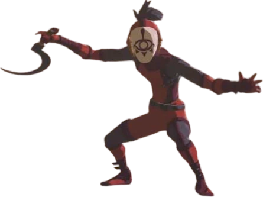

Imagen local: `imagenes/16-soldado-infanteria-yiga.webp`

Tipo: Guerrero del Clan Yiga.

Descripcion: Estos enemigos pueden hacerse pasar por viajeros antes de revelar su identidad. Son rapidos y usan teletransporte.

Variantes: Soldado basico del clan.

Como enfrentarlo: Hay que vigilar sus movimientos rapidos, bloquear o esquivar sus ataques y aprovechar los disparos a la cabeza.

Idea para el libro: Funcionan como enemigos misteriosos que parecen normales hasta que se descubre su disfraz.

### Maestro de la espada Yiga

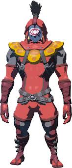

Imagen local: `imagenes/17-maestro-espada-yiga.jpg`

Tipo: Guerrero fuerte del Clan Yiga.

Descripcion: Es mas grande y peligroso que un soldado comun del clan. Usa una gran espada capaz de lanzar cortes de viento.

Variantes: Guerrero avanzado del clan.

Como enfrentarlo: Conviene esperar sus ataques pesados, esquivar y contraatacar. Estasis+ puede dar una pequena ventana de ventaja.

Idea para el libro: Puede ser el guardian serio del clan, con una espada enorme y mucha disciplina.

## Enemigos elementales y magicos

### Keese

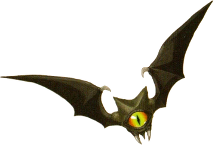

Imagen local: `imagenes/18-keese.webp`

Tipo: Criatura voladora pequena.

Descripcion: Los Keese son parecidos a murcielagos y suelen atacar en grupos, especialmente de noche o en lugares oscuros.

Variantes: Normal, fuego, hielo y electrico.

Como enfrentarlo: Tienen poca resistencia. Las flechas, bombas o armas con buen alcance sirven bien. Contra variantes elementales, es mejor evitar el contacto directo.

Idea para el libro: Pueden llenar una escena nocturna con pequenas siluetas brillantes.

### ChuChu

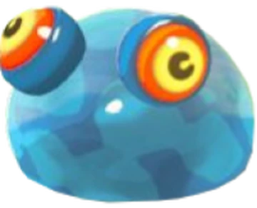

Imagen local: `imagenes/19-chuchu.webp`

Tipo: Criatura gelatinosa.

Descripcion: Los ChuChu son masas saltarinas que se acercan a Link. Parecen simples, pero sus versiones elementales pueden explotar.

Variantes: Pequeno, grande, normal, fuego, hielo y electrico.

Como enfrentarlo: Casi cualquier ataque funciona. Contra los elementales conviene golpearlos desde lejos para evitar la explosion.

Idea para el libro: Son buenos para una pagina mas juguetona: blandos, saltarines y peligrosos si se tocan sin cuidado.

### Wizzrobe

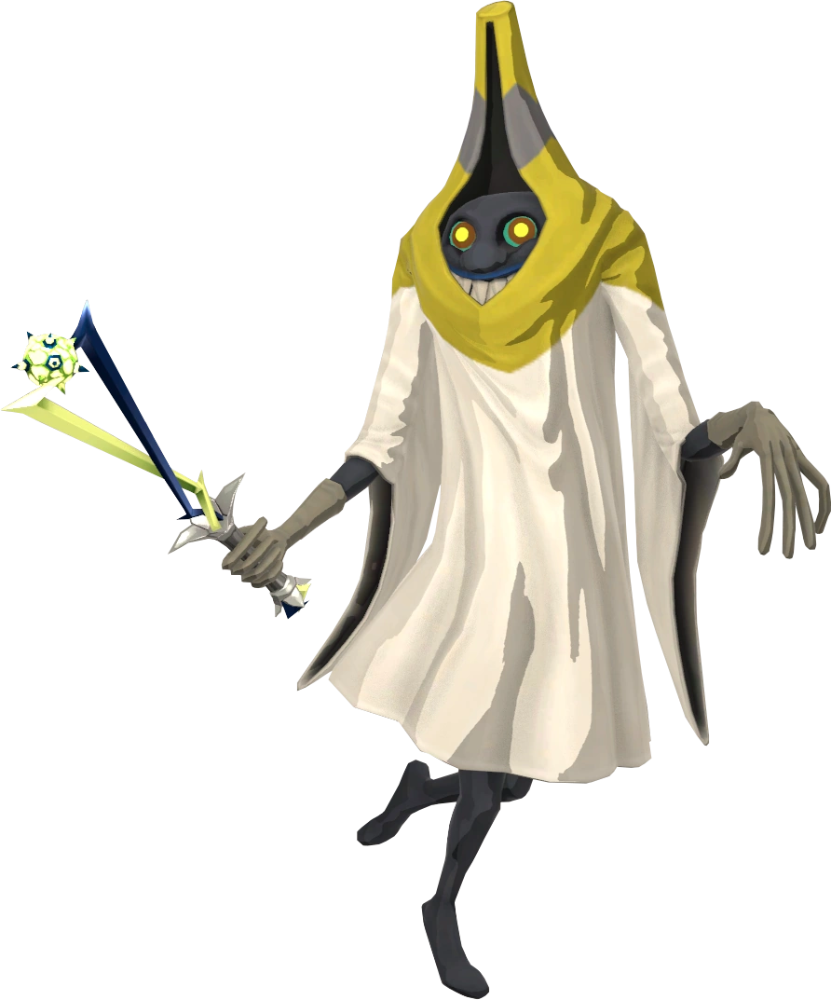

Imagen local: `imagenes/20-wizzrobe.webp`

Tipo: Mago elemental.

Descripcion: Los Wizzrobe son hechiceros inquietos que bailan, se teletransportan y lanzan magia de fuego, hielo o electricidad.

Variantes: Fuego, hielo, electrico, meteorito, ventisca y trueno.

Como enfrentarlo: Usar el elemento contrario suele ser la mejor opcion: hielo contra fuego y fuego contra hielo. Para los electricos, las flechas y bombas ayudan.

Idea para el libro: Pueden tener una pagina muy visual, con clima cambiando alrededor de sus varas magicas.

### Malicia (Ojos, Bocas, Charcos)

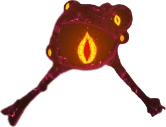

Imagen local: `imagenes/21-malicia.png`

Tipo: Corrupcion de Ganon.

Descripcion: La Malicia aparece como una sustancia oscura y peligrosa. Puede bloquear caminos, crear bocas monstruosas o mostrar ojos brillantes.

Variantes: Ojos, bocas y charcos.

Como enfrentarlo: Los charcos no se derrotan directamente. La clave suele ser encontrar el ojo naranja y dispararle con una flecha.

Idea para el libro: Puede mostrarse como una sombra viva que cubre lugares antiguos.

### Cabezas malditas

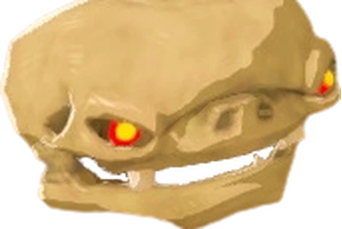

Imagen local: `imagenes/22-cabezas-malditas.webp`

Tipo: Enemigos creados por Malicia.

Descripcion: Son craneos flotantes de Bokoblin, Moblin o Lizalfos, envueltos en energia oscura.

Variantes: Cabeza de Bokoblin, Moblin y Lizalfos.

Como enfrentarlo: Son fragiles, pero pueden reaparecer mientras la Boca de Malicia siga activa. Lo importante es destruir el ojo que alimenta la infestacion.

Idea para el libro: Sirven para una escena de castillo embrujado sin hacerla demasiado pesada.

### Enemigos Stal

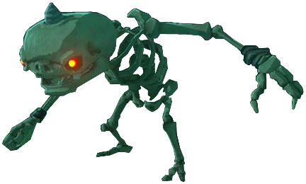

Imagen local: `imagenes/23-enemigos-stal.webp`

Tipo: Esqueletos reanimados.

Descripcion: Son versiones esqueleticas de enemigos comunes que aparecen de noche y pueden volver a armarse si no se destruye su cabeza.

Variantes: Stalkoblin, Stalmoblin y Stalizalfos.

Como enfrentarlo: Primero se derrumba el cuerpo; luego hay que destruir el craneo antes de que se reconstruya.

Idea para el libro: Ideales para una seccion nocturna donde el suelo se mueve y aparecen huesos.

## Jefes de mazmorra

### Ganon de la plaga de agua (Vah Ruta)

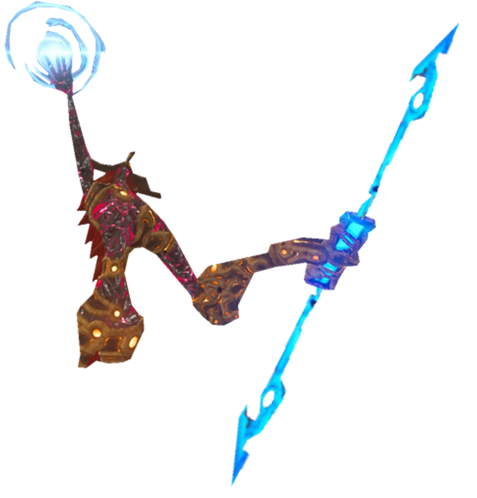

Imagen local: `imagenes/24-ganon-plaga-agua.png`

Tipo: Jefe de Bestia Divina.

Descripcion: Es la manifestacion de la Malicia que domina Vah Ruta. Usa una lanza larga y ataques relacionados con el hielo y el agua.

Variantes: Plaga de agua.

Como enfrentarlo: Hay que romper bloques de hielo con Cryonis, atacar su ojo y aprovechar los momentos en que queda vulnerable.

Idea para el libro: Puede tener una escena fria y acuatica, con una lanza brillante sobre plataformas mojadas.

### Ganon de la Plaga de Fuego (Vah Rudania)

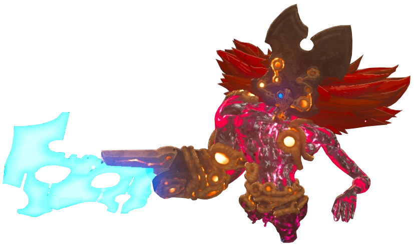

Imagen local: `imagenes/25-ganon-plaga-fuego.webp`

Tipo: Jefe de Bestia Divina.

Descripcion: Esta plaga usa fuego y una espada enorme. Se enfrenta dentro de Vah Rudania.

Variantes: Plaga de fuego.

Como enfrentarlo: En una fase conviene atacar a distancia. Cuando absorbe aire para lanzar una gran bola de fuego, una bomba remota puede aturdirlo.

Idea para el libro: Perfecto para una pagina volcanica con calor, fuego y sombras rojas.

### Ganon de la Plaga del Viento (Vah Medoh)

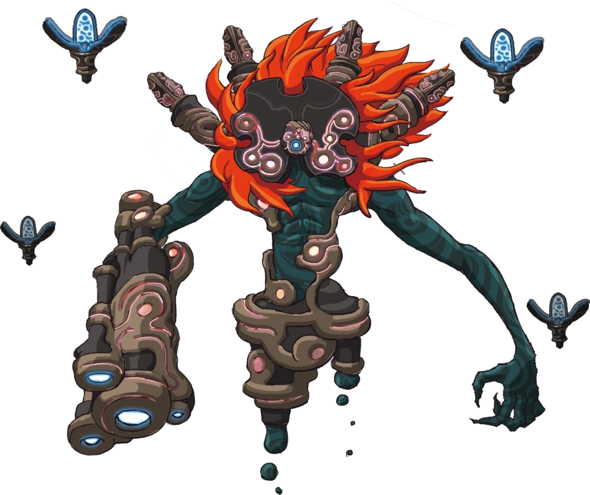

Imagen local: `imagenes/26-ganon-plaga-viento.webp`

Tipo: Jefe de Bestia Divina.

Descripcion: Ataca desde lejos con un canon y crea tornados en la arena de combate.

Variantes: Plaga del viento.

Como enfrentarlo: Las corrientes de aire ayudan a Link a saltar y disparar en camara lenta. Apuntar al ojo es fundamental.

Idea para el libro: Una escena con viento, altura y flechas puede quedar muy dinamica.

### Ganon del Trueno (Vah Naboris)

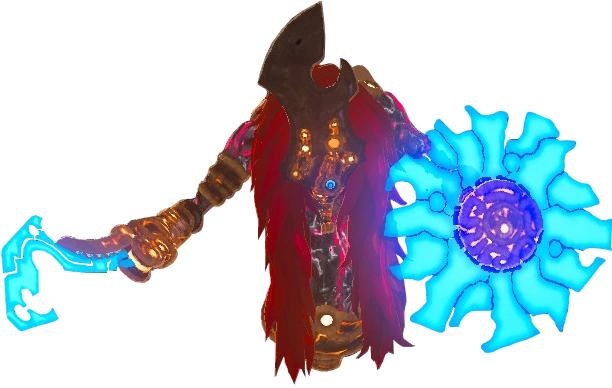

Imagen local: `imagenes/27-ganon-trueno.webp`

Tipo: Jefe de Bestia Divina.

Descripcion: Es una plaga velocisima que usa electricidad, espada y escudo. Muchos jugadores la consideran una de las mas dificiles.

Variantes: Plaga del trueno.

Como enfrentarlo: Requiere reflejos precisos. En una fase, Link puede usar Magnesis con pilares metalicos para devolverle su propia electricidad.

Idea para el libro: Puede ser una pagina de rayos y velocidad, casi como un relampago con forma de enemigo.

## Jefe final

### Calamity Ganon

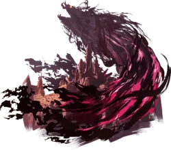

Imagen local: `imagenes/28-calamity-ganon.png`

Tipo: Jefe final.

Descripcion: Es la forma monstruosa e incompleta de Ganon dentro del Castillo de Hyrule, mezclando Malicia y tecnologia antigua.

Variantes: Forma de combate principal.

Como enfrentarlo: Usa ataques inspirados en las plagas y en los Guardianes. Las paradas perfectas, las habilidades de los Campeones y la Espada Maestra son muy importantes.

Idea para el libro: Puede ser el gran enemigo oscuro que resume todos los peligros anteriores.

### Dark Beast Ganon

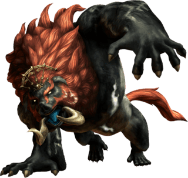

Imagen local: `imagenes/29-dark-beast-ganon.png`

Tipo: Forma final de Ganon.

Descripcion: Es una bestia gigantesca de Malicia que se enfrenta en el campo abierto, como una sombra enorme sobre Hyrule.

Variantes: Forma bestial final.

Como enfrentarlo: Link cabalga, esquiva su rayo y usa el Arco de Luz para disparar a los puntos debiles que Zelda revela.

Idea para el libro: Es una buena pagina final: grande, luminosa y con sensacion de cierre heroico.

## Fichas ampliadas: datos, curiosidades e imagen extra

Nota sobre alturas: no encontre medidas oficiales de altura para estas criaturas en las fuentes revisadas. Para el libro uso "escala visual editorial", que sirve para maquetar y explicar tamanos comparados con Link, pero no debe tratarse como dato canonico.

Fuentes secundarias usadas: [Hyrule Compendium API](https://api.hyrule-compendium.com/v3/compendium/category/monsters), [Zelda Wiki - Aerocuda](https://zeldawiki.wiki/wiki/Aerocuda), [Zelda Wiki - Glowing Eyeball](https://zeldawiki.wiki/wiki/Glowing_Eyeball).

### Bokoblin - datos extra

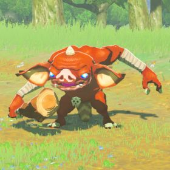

Imagen extra local: `imagenes_extra/01-bokoblin-compendio.png`

- Compendio: entrada 103.
- Ubicaciones comunes: Hyrule Field, West Necluda.
- Materiales: Bokoblin horn, Bokoblin fang.
- Escala visual editorial: bajo a mediano; normalmente menor que Link o cercano a su altura segun postura.
- Curiosidad: aunque son carnivoros feroces, el compendio menciona que tambien disfrutan la fruta.

### Moblin - datos extra

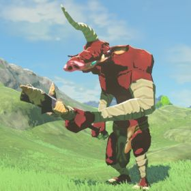

Imagen extra local: `imagenes_extra/02-moblin-compendio.png`

- Compendio: entrada 108.
- Ubicaciones comunes: Hyrule Field, East Necluda.
- Materiales: Moblin horn, Moblin fang.
- Escala visual editorial: muy alto; claramente mas grande que Link.
- Curiosidad: pueden levantar Bokoblins y lanzarlos como proyectiles improvisados.

### Lizalfos - datos extra

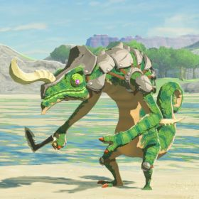

Imagen extra local: `imagenes_extra/03-lizalfos-compendio.png`

- Compendio: entrada 113.
- Ubicaciones comunes: Lanayru Great Spring, Gerudo Desert.
- Materiales: Lizalfos horn, Lizalfos talon.
- Escala visual editorial: mediano; parecido a Link en altura, pero mas alargado y agachado.
- Curiosidad: el compendio los describe como enemigos que no duermen y que pueden camuflarse para tender emboscadas.

### Octorok - datos extra

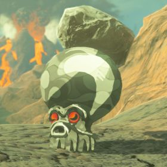

Imagen extra local: `imagenes_extra/04-octorok-compendio.png`

- Compendio usado como representante: Rock Octorok, entrada 94.
- Ubicaciones comunes: Eldin Canyon, Gerudo Highlands.
- Materiales: Octorok tentacle, Octo balloon, Octorok eyeball.
- Escala visual editorial: pequeno a mediano; compacto y mucho mas bajo que Link.
- Curiosidad: cuando inhalan pueden tragarse bombas o armas, no solo preparar un disparo de roca.

### Aerocuda - datos extra

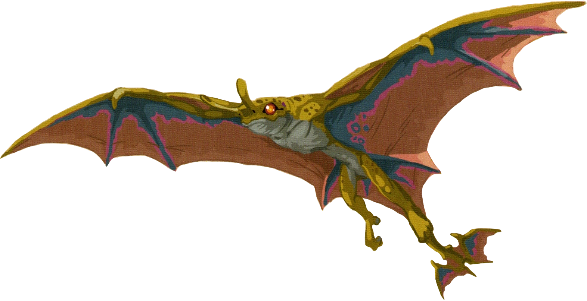

Imagen extra local: `imagenes_extra/05-aerocuda-extra.png`

- Fuente secundaria: Zelda Wiki, entrada de Tears of the Kingdom.
- Compendio de Tears of the Kingdom: entrada 118.
- Ubicaciones comunes segun TotK: Greater Hyrule.
- Materiales segun TotK: Aerocuda Wing, Aerocuda Eyeball.
- Escala visual editorial: criatura voladora ligera, mas pequena que la mayoria de jefes y facil de derribar.
- Curiosidad: no es una entrada de Breath of the Wild; la fuente base lo incluye, pero conviene decidir si se queda en un libro estrictamente BotW.

### Guijarro - datos extra

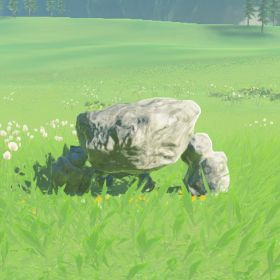

Imagen extra local: `imagenes_extra/06-guijarro-compendio.png`

- Compendio usado como representante: Stone Pebblit, entrada 143.
- Ubicaciones comunes: Greater Hyrule.
- Materiales: Flint, Amber, Opal.
- Escala visual editorial: muy pequeno; Link puede levantarlo y lanzarlo.
- Curiosidad: es una version joven de un Stone Talus, fragil antes de endurecerse por completo.

### Guardian acosador - datos extra

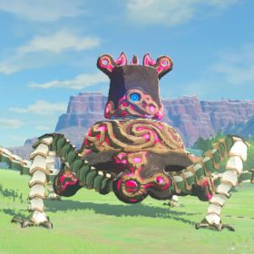

Imagen extra local: `imagenes_extra/07-guardian-acosador-compendio.png`

- Compendio: entrada 125.
- Ubicaciones comunes: Hyrule Field.
- Materiales: Ancient screw, Ancient spring, Ancient gear, Ancient shaft, Ancient core, Giant ancient core.
- Escala visual editorial: enorme; una maquina de varias patas, mas parecida a un vehiculo que a un enemigo humanoide.
- Curiosidad: destruirle las patas reduce mucho su movilidad.

### Guardian Observador del Cielo - datos extra

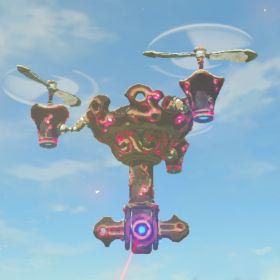

Imagen extra local: `imagenes_extra/08-guardian-observador-del-cielo-compendio.png`

- Compendio: entrada 126.
- Ubicaciones comunes: Hyrule Field, Akkala Highlands.
- Materiales: Ancient screw, Ancient spring, Ancient gear, Ancient shaft, Ancient core, Giant ancient core.
- Escala visual editorial: maquina aerea grande; no se mide por altura sino por presencia sobre el escenario.
- Curiosidad: romper sus propulsores puede hacerlo caer.

### Torreta Guardiana - datos extra

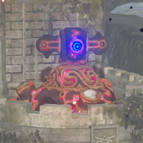

Imagen extra local: `imagenes_extra/09-torreta-guardiana-compendio.png`

- Compendio: entrada 127.
- Ubicaciones comunes: Hyrule Castle.
- Materiales: Ancient screw, Ancient spring, Ancient gear, Ancient shaft, Ancient core, Giant ancient core.
- Escala visual editorial: estructura fija grande, mas alta y pesada que Link.
- Curiosidad: el compendio explica que omitir las patas reducia el costo de fabricacion.

### Guardian Explorador (I-IV) - datos extra

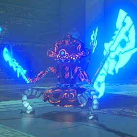

Imagen extra local: `imagenes_extra/10-guardian-explorador-compendio.png`

- Compendio usado como representante: Guardian Scout IV, entrada 133.
- Ubicaciones comunes: pruebas de santuarios, sin ubicacion abierta listada en el API.
- Materiales: Ancient screw, Ancient spring, Ancient gear, Ancient shaft, Ancient core.
- Escala visual editorial: mediano; mas pequeno que los Guardianes de campo, pero armado para duelo.
- Curiosidad: el nivel IV puede usar tres armas, lo que lo convierte en una prueba seria de combate.

### Guardian decaido - datos extra

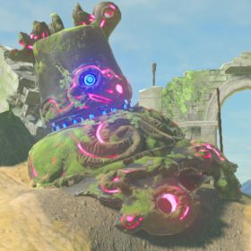

Imagen extra local: `imagenes_extra/11-guardian-decaido-compendio.png`

- Compendio: entrada 129.
- Ubicaciones comunes: Hyrule Field, Hyrule Castle.
- Materiales: Ancient screw, Ancient spring, Ancient gear, Ancient shaft.
- Escala visual editorial: restos grandes en el suelo; no se desplaza, pero conserva presencia de maquina pesada.
- Curiosidad: parece arruinado, pero algunos aun pueden despertar y disparar.

### Talus de piedra - datos extra

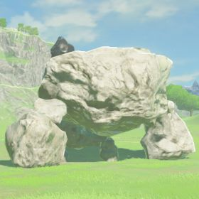

Imagen extra local: `imagenes_extra/12-talus-de-piedra-compendio.png`

- Compendio: entrada 138.
- Ubicaciones comunes: West Necluda, East Necluda.
- Materiales: Flint, Amber, Opal, Ruby.
- Escala visual editorial: gigante; funciona casi como una colina que se levanta.
- Curiosidad: ni espada ni flecha atraviesan su cuerpo de roca; el mineral de la espalda es la clave.

### Hinox - datos extra

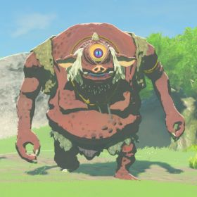

Imagen extra local: `imagenes_extra/13-hinox-compendio.png`

- Compendio: entrada 147.
- Ubicaciones comunes: East Necluda, West Necluda.
- Materiales: Hinox toenail, Hinox tooth, Hinox guts, frutas y otros alimentos.
- Escala visual editorial: gigante; el compendio lo describe como el monstruo mas grande que hace hogar en Hyrule.
- Curiosidad: puede arrancar arboles enteros y usarlos como armas.

### Molduga - datos extra

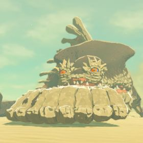

Imagen extra local: `imagenes_extra/14-molduga-compendio.png`

- Compendio: entrada 151.
- Ubicaciones comunes: Gerudo Desert.
- Materiales: Molduga fin, Molduga guts.
- Escala visual editorial: colosal; su tamano se siente mas como el de una criatura marina bajo la arena.
- Curiosidad: responde al sonido y a las vibraciones, por eso correr sin cuidado puede atraerla.

### Lynel - datos extra

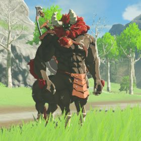

Imagen extra local: `imagenes_extra/15-lynel-compendio.png`

- Compendio: entrada 121.
- Ubicaciones comunes: Lanayru Great Spring, Hyrule Field.
- Materiales: Lynel horn, Lynel hoof, Lynel guts.
- Escala visual editorial: grande; mas alto y ancho que Link, con cuerpo de centauro.
- Curiosidad: el compendio destaca su inteligencia, fuerza y resistencia elemental natural.

### Soldado de infanteria Yiga - datos extra

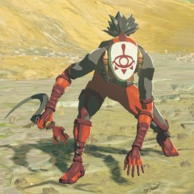

Imagen extra local: `imagenes_extra/16-soldado-infanteria-yiga-compendio.png`

- Compendio: entrada 134.
- Ubicaciones comunes: sin ubicacion fija listada en el API; aparecen por Hyrule y tambien tras disfraces.
- Materiales: Rupees verdes, azules, rojos, purpuras y Mighty Bananas.
- Escala visual editorial: humanoide, similar a Link.
- Curiosidad: pueden disfrazarse de viajeros o aldeanos para atacar por sorpresa.

### Maestro de la espada Yiga - datos extra

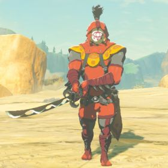

Imagen extra local: `imagenes_extra/17-maestro-espada-yiga-compendio.png`

- Compendio: entrada 135.
- Ubicaciones comunes: sin ubicacion fija listada en el API.
- Materiales: Amber, Opal, Topaz, Ruby, Sapphire, Mighty Bananas.
- Escala visual editorial: humanoide alto y robusto.
- Curiosidad: su presencia marca un salto de peligro dentro del Clan Yiga por su arma grande y ataques de viento.

### Keese - datos extra

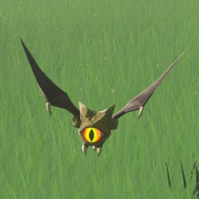

Imagen extra local: `imagenes_extra/18-keese-compendio.png`

- Compendio: entrada 88.
- Ubicaciones comunes: Hyrule Field, East Necluda.
- Materiales: Keese wing, Keese eyeball.
- Escala visual editorial: muy pequeno; funciona mejor como amenaza de enjambre que como rival individual.
- Curiosidad: su vuelo impredecible es lo que los vuelve molestos, aunque caen con un solo golpe.

### ChuChu - datos extra

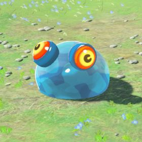

Imagen extra local: `imagenes_extra/19-chuchu-compendio.png`

- Compendio: entrada 84.
- Ubicaciones comunes: Hyrule Field, West Necluda.
- Materiales: Chuchu jelly.
- Escala visual editorial: variable; puede ser pequeno o grande, pero siempre con cuerpo gelatinoso.
- Curiosidad: la gelatina que deja puede cambiar de elemento segun si el ChuChu fue calentado, enfriado o electrocutado.

### Wizzrobe - datos extra

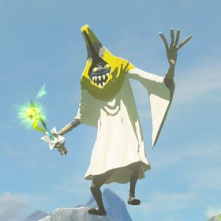

Imagen extra local: `imagenes_extra/20-wizzrobe-compendio.png`

- Compendio usado como representante: Electric Wizzrobe, entrada 99.
- Ubicaciones comunes: Hyrule Ridge, West Necluda.
- Materiales: el API no lista materiales recuperables para esta entrada.
- Escala visual editorial: humanoide magico mediano, mas importante por su movimiento y magia que por tamano.
- Curiosidad: algunos Wizzrobes pueden alterar el clima local; al derrotarlos, el clima vuelve a la normalidad.

### Malicia (Ojos, Bocas, Charcos) - datos extra

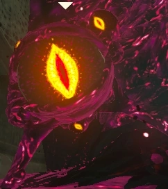

Imagen extra local: `imagenes_extra/21-malicia-glowing-eyeball.png`

- Fuente secundaria: Zelda Wiki, entrada Glowing Eyeball.
- Ubicaciones comunes citadas: zonas con Malicia como Hyrule Castle, Divine Beasts y Akkala Tower.
- Materiales: no aplica como botin normal.
- Escala visual editorial: variable; puede ser charco, masa, boca o un ojo brillante.
- Curiosidad: destruir un ojo brillante puede hacer desaparecer la Malicia conectada a el.

### Cabezas malditas - datos extra

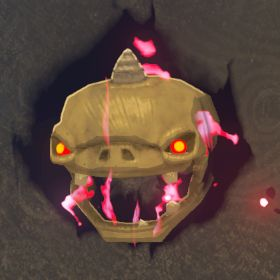

Imagen extra local: `imagenes_extra/22-cabezas-malditas-compendio.png`

- Compendio usado como representante: Cursed Bokoblin, entrada 156. Entradas relacionadas: Cursed Moblin 157 y Cursed Lizalfos 158.
- Ubicaciones comunes: asociadas a zonas de Malicia; el API no lista ubicacion fija para Cursed Bokoblin.
- Materiales: el API no lista materiales recuperables.
- Escala visual editorial: pequeno; craneo flotante y fragil.
- Curiosidad: no conservan la inteligencia del monstruo original, solo el impulso de atacar.

### Enemigos Stal - datos extra

Imagen extra local: `imagenes_extra/23-enemigos-stal-compendio.png`

- Compendio usado como representante: Stalkoblin, entrada 106. Entradas relacionadas: Stalmoblin 111 y Stalizalfos 116.
- Ubicaciones comunes: Hyrule Field, Great Hyrule Forest.
- Materiales: Bokoblin horn, Bokoblin fang en el Stalkoblin usado como representante.
- Escala visual editorial: similar al monstruo original, pero con cuerpo esqueletico y fragil.
- Curiosidad: a veces el cuerpo puede agarrar el craneo equivocado y seguir peleando igual.

### Ganon de la plaga de agua - datos extra

Imagen extra local: `imagenes_extra/24-ganon-plaga-agua-compendio.png`

- Compendio: entrada 161.
- Ubicacion: Divine Beast Vah Ruta.
- Materiales: sin botin listado.
- Escala visual editorial: jefe grande, muy superior a Link en presencia y alcance.
- Curiosidad: fue responsable de la muerte de la Campeona Mipha.

### Ganon de la Plaga de Fuego - datos extra

Imagen extra local: `imagenes_extra/25-ganon-plaga-fuego-compendio.png`

- Compendio: entrada 160.
- Ubicacion: Divine Beast Vah Rudania.
- Materiales: sin botin listado.
- Escala visual editorial: jefe grande, con silueta pesada por la espada y el fuego.
- Curiosidad: fue responsable de la muerte del Campeon Daruk.

### Ganon de la Plaga del Viento - datos extra

Imagen extra local: `imagenes_extra/26-ganon-plaga-viento-compendio.png`

- Compendio: entrada 162.
- Ubicacion: Divine Beast Vah Medoh.
- Materiales: sin botin listado.
- Escala visual editorial: jefe grande, disenado para sentirse peligroso desde lejos.
- Curiosidad: fue responsable de la muerte del Campeon Revali.

### Ganon del Trueno - datos extra

Imagen extra local: `imagenes_extra/27-ganon-trueno-compendio.png`

- Compendio: entrada 159.
- Ubicacion: Divine Beast Vah Naboris.
- Materiales: sin botin listado.
- Escala visual editorial: jefe grande, pero su amenaza principal es la velocidad.
- Curiosidad: fue responsable de la muerte de la Campeona Urbosa.

### Calamity Ganon - datos extra

Imagen extra local: `imagenes_extra/28-calamity-ganon-compendio.png`

- Compendio: entrada 163.
- Ubicacion: Hyrule Castle.
- Materiales: sin botin listado.
- Escala visual editorial: enorme; mezcla cuerpo monstruoso con tecnologia corrompida.
- Curiosidad: el compendio lo presenta como una forma fisica incompleta que se vio obligada a enfrentar a Link antes de terminar su regeneracion.

### Dark Beast Ganon - datos extra

Imagen extra local: `imagenes_extra/29-dark-beast-ganon-compendio.png`

- Compendio: entrada 164.
- Ubicacion: Hyrule Field.
- Materiales: sin botin listado.
- Escala visual editorial: colosal; conviene tratarlo visualmente como una bestia de paisaje.
- Curiosidad: el compendio lo describe como una forma consumida por la Malicia, movida solo por el deseo de destruir.
